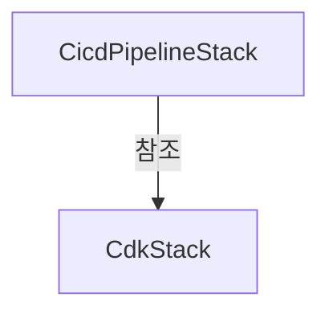
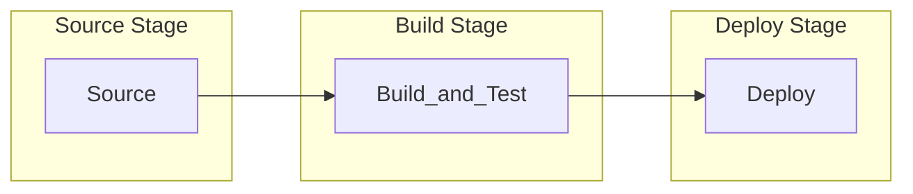

# AWS ECS + CodePipeline CI/CD 구축하기

AWS CodePipeline을 이용하여 ECS 컨테이너 서비스를 무중단 배포하는 방법에 대해 다루고 있습니다.

<br />

## 사전 설정

이 프로젝트를 실행하기 위해 다음 도구들이 필요합니다:

### 1. AWS CLI 설치 및 구성

AWS CLI는 명령줄에서 AWS 서비스와 상호 작용할 수 있게 해주는 도구입니다.

#### 설치 방법

- **macOS**:
  ```bash
  brew install awscli
  ```

#### AWS 프로필 구성

AWS CLI를 설치한 후, IAM 사용자 자격 증명으로 프로필을 구성해야 합니다:

```bash
aws configure
```

프롬프트에 다음 정보를 입력합니다:
- AWS Access Key ID
- AWS Secret Access Key
- Default region name (예: ap-northeast-2)
- Default output format (json 권장)

여러 AWS 계정이나 역할을 사용해야 하는 경우, 명명된 프로필을 사용할 수 있습니다:

```bash
aws configure --profile myprofile
```

이후 명령어 실행 시 `--profile myprofile` 옵션을 추가하여 특정 프로필을 사용할 수 있습니다.

> 자세한 내용은 [AWS 공식 문서: AWS CLI 구성](https://docs.aws.amazon.com/ko_kr/cli/latest/userguide/cli-configure-quickstart.html)을 참조하세요.

### 2. Docker 설치

Docker는 컨테이너 기반 애플리케이션을 빌드, 테스트 및 배포하는 데 사용됩니다.

### 3. Node.js 설치

이 프로젝트는 Node.js 20 버전 이상이 필요합니다.

### 4. GitHub 저장소 설정

CI/CD 파이프라인은 GitHub 저장소와 연동되어 코드 변경 사항을 자동으로 감지하고 배포합니다. `cdk/bin/cdk.ts` 파일에서 다음 설정을 업데이트해야 합니다:

```typescript
new CicdPipelineStack(app, 'EcsCodePipelinePracticeCicdStack', {
  stack,
  githubOwner: 'github-owner-name',     // GitHub 사용자명 또는 조직명
  githubRepo: 'your-github-repository-name',  // GitHub 저장소 이름
  githubBranch: 'main',                 // 배포할 브랜치 이름
  notificationEmail: 'your-email@gmail.com',  // 알림을 받을 이메일 주소
});
```

예를 들어, GitHub 저장소 URL이 `https://github.com/boy672820/aws-ecs-codepipeline-practice`인 경우:
- `githubOwner`: boy672820
- `githubRepo`: aws-ecs-codepipeline-practice

이 설정은 CodePipeline이 어떤 GitHub 저장소를 모니터링할지, 그리고 배포 실패 시 알림을 받을 이메일 주소를 지정합니다.

<br />

## 프로젝트 설정 및 배포

다음 단계에 따라 프로젝트를 설정하고 배포합니다:

### 1. GitHub 저장소 설정

#### 저장소 클론
```bash
git clone https://github.com/boy672820/aws-ecs-codepipeline-practice.git
cd aws-ecs-codepipeline-practice
```

#### 종속성 패키지 설치
```bash
npm install
```

### 2. GitHub 연동 설정

CodePipeline이 GitHub 저장소의 변경 사항을 감지하도록 설정합니다.

#### GitHub 토큰 생성
1. GitHub 계정 설정 > Developer settings > Personal access tokens > Fine-grained tokens로 이동
2. 새 토큰 생성 시 다음 권한 설정:
   - Repository access: 해당 저장소 선택
   - Permissions > Repository permissions > Webhooks: Read and write

#### AWS Secrets Manager에 토큰 저장
CLI 또는 AWS Management Console에서 Secrets Manager 서비스로 이동하여 비밀 값을 생성할 수도 있습니다.
```bash
# CLI를 이용한 Secret 생성 방법
aws secretsmanager create-secret \
    --name dev/ecs-codepipeline-practice/github-token-v2 \
    --secret-string "[GitHub 토큰 값]"
```

### 3. AWS ECR 저장소 생성 및 이미지 배포

ECR 저장소를 생성하고 초기 컨테이너 이미지를 푸시합니다.

```bash
# deploy.sh 스크립트 실행
sh deploy.sh
```

`deploy.sh` 스크립트는 다음 작업을 수행합니다:
- ECR 저장소 생성 (없는 경우)
- Docker 이미지 빌드
- ECR에 이미지 푸시

### 4. AWS CDK 배포

CDK를 사용하여 인프라를 배포합니다.

#### CDK 부트스트래핑 (최초 1회)
```bash
npm run -w cdk -- bootstrap
```

부트스트래핑은 AWS 계정에 CDK를 사용하기 위한 리소스를 프로비저닝합니다. 이 작업은 계정 및 리전당 한 번만 수행하면 됩니다.

#### 스택 배포
```bash
npm run -w cdk -- deploy --all
```

`--all` 옵션을 사용하면 모든 스택을 한 번에 배포합니다. 특정 스택만 배포하려면:

```bash
# 서비스 인프라 스택만 배포
npm run -w cdk -- deploy EcsCodePipelinePracticeStack

# CI/CD 파이프라인 스택만 배포
npm run -w cdk -- deploy EcsCodePipelinePracticeCicdStack
```

배포가 완료되면 CloudFormation 출력에서 ALB DNS 이름과 같은 중요한 정보를 확인할 수 있습니다.

<br />

---

## 1. 인프라 환경

인프라 환경은 서비스를 구성하는 인프라와 CI/CD 환경 두 가지로 분리되어 있습니다.

- **서비스 인프라 스택 (CdkStack)**: 서비스를 운영하기 위한 인프라 환경을 구성하는 CDK 스택입니다.
- **CI/CD 파이프라인 스택 (CicdPipelineStack)**: CodePipeline 기반의 CI/CD 전용 스택입니다.

### 스택 분리

CI/CD가 인프라가 분리되어 있는 이유는 다음과 같습니다.

1. **서비스 운영 인프라의 영향을 크게 받지 않음**
   - 서비스 인프라 변경이 CI/CD 파이프라인에 영향을 주지 않음
   - 서비스 배포 실패가 CI/CD 시스템 자체에 영향을 미치지 않음
   - 인프라 변경 시 CI/CD 파이프라인을 재구성할 필요가 없음

2. **별도의 환경에서 CI/CD 운영**
   - CI/CD 파이프라인에 대한 권한과 접근 관리를 별도로 설정 가능
   - CI/CD 인프라의 리소스 관리와 최적화를 독립적으로 수행 가능
   - 파이프라인 자체의 업그레이드나 변경이 더 안전하게 이루어짐

3. **추가적인 이점**
   - **확장성 향상**: 서비스가 확장되더라도 CI/CD 파이프라인은 독립적으로 유지
   - **보안 강화**: 권한 분리를 통한 보안 경계 설정 가능
   - **유지보수 용이성**: 각 스택을 독립적으로 관리하고 업데이트 가능
   - **재사용성**: 동일한 CI/CD 파이프라인을 여러 서비스에 적용 가능

> 이 구조를 통해 서비스 인프라와 CI/CD 파이프라인을 독립적으로 관리하면서도 효율적인 배포 프로세스를 구현할 수 있습니다.

<br />

## 2. AWS CDK 구성

이 프로젝트는 AWS CDK를 사용하여 인프라를 코드로 정의하고 있으며, 다음과 같은 구조로 구성되어 있습니다.



### 서비스 인프라 스택 (CdkStack)

`CdkStack`은 서비스 운영에 필요한 인프라 리소스를 정의합니다:

- **네트워크 계층**: VPC, 서브넷, 보안 그룹
- **컨테이너 레지스트리**: ECR 리포지토리
- **컨테이너 오케스트레이션**: ECS 클러스터, Fargate 서비스, 태스크 정의
- **로드 밸런싱**: Application Load Balancer, 대상 그룹, 리스너

주요 리소스들은 public 속성으로 노출되어 CI/CD 스택에서 참조할 수 있습니다:

```typescript
public readonly vpc: ec2.Vpc;
public readonly ecsCluster: ecs.Cluster;
public readonly ecsService: ecs.FargateService;
public readonly ecrRepository: ecr.IRepository;
public readonly containerName: string;
```

### CI/CD 파이프라인 스택 (CicdPipelineStack)

`CicdPipelineStack`은 CI/CD 파이프라인과 관련 리소스를 정의합니다:

- **소스 제어**: GitHub 저장소 연동
- **빌드 환경**: CodeBuild 프로젝트 (Docker 빌드 지원)
- **파이프라인**: CodePipeline (소스, 빌드, 배포 단계)
- **알림**: SNS 주제, CloudWatch 알람

CI/CD 스택은 서비스 스택의 리소스를 참조하여 배포 프로세스를 구성합니다:

```typescript
export interface CicdPipelineStackProps extends cdk.StackProps {
  stack: CdkStack; // 서비스 인프라 스택 참조
  githubOwner: string;
  githubRepo: string;
  githubBranch: string;
  notificationEmail?: string;
}
```

### 배포 프로세스

1. GitHub 저장소에서 코드 변경 감지
2. CodeBuild에서 Docker 이미지 빌드 및 ECR 푸시
3. ECS 서비스 업데이트 (새 이미지로 롤링 업데이트)
4. 배포 결과에 따른 알림 전송

<br />

## 3. 배포 파이프라인 구성

이 프로젝트는 AWS CodePipeline을 사용하여 지속적 통합 및 배포(CI/CD) 파이프라인을 구현합니다. 파이프라인은 코드 변경이 감지되면 자동으로 빌드, 테스트 및 배포 프로세스를 실행합니다.

### CodePipeline 구조

파이프라인은 다음 세 가지 주요 단계로 구성됩니다:



#### 1. Source 단계

GitHub 저장소에서 소스 코드를 가져오는 단계입니다.

```typescript
// 소스 단계 구성
pipeline.addStage({
  stageName: 'Source',
  actions: [
    new codepipeline_actions.GitHubSourceAction({
      actionName: 'GitHub_Source',
      owner: props.githubOwner,
      repo: props.githubRepo,
      branch: props.githubBranch,
      oauthToken: cdk.SecretValue.secretsManager(
        'dev/ecs-codepipeline-practice/github-token-v2',
      ),
      output: sourceOutput,
      trigger: codepipeline_actions.GitHubTrigger.WEBHOOK,
    }),
  ],
});
```

- **GitHub 연동**: GitHub 웹훅을 통해 코드 변경 사항을 자동으로 감지합니다.
- **인증**: AWS Secrets Manager에 저장된 GitHub 토큰을 사용하여 저장소에 접근합니다.
- **출력**: 소스 코드는 파이프라인 아티팩트(`sourceOutput`)로 저장되어 다음 단계로 전달됩니다.

>프로젝트 루트 경로에 buildspec.yml 파일이 존재해야 합니다. CodePipeline은 기본적으로 루트 경로에 buildspec.yml 파일을 자동으로 가져와 파이프라인을 실행합니다.

#### 2. Build_and_Test 단계

소스 코드를 빌드하고 테스트하는 단계입니다. AWS CodeBuild 서비스를 사용합니다.

```typescript
// 빌드 및 테스트 단계 구성
pipeline.addStage({
  stageName: 'Build_and_Test',
  actions: [
    new codepipeline_actions.CodeBuildAction({
      actionName: 'Build_and_Test',
      project: buildProject,
      input: sourceOutput,
      outputs: [buildOutput],
      executeBatchBuild: false,
    }),
  ],
});
```

- **CodeBuild 프로젝트**: 빌드 환경과 프로세스를 정의합니다.
- **입력**: Source 단계에서 생성된 아티팩트를 사용합니다.
- **출력**: 빌드 결과물은 `buildOutput` 아티팩트로 저장됩니다.

#### 3. Deploy 단계

빌드된 Docker 이미지를 ECS 서비스에 배포하는 단계입니다.

```typescript
// 배포 단계 구성
pipeline.addStage({
  stageName: 'Deploy',
  actions: [
    new codepipeline_actions.EcsDeployAction({
      actionName: 'Deploy_to_ECS',
      service: props.stack.ecsService,
      imageFile: buildOutput.atPath('imageDefinitions.json'),
    }),
  ],
});
```

- **ECS 배포**: ECS 서비스를 새 이미지로 업데이트합니다.
- **이미지 정의 파일**: `imageDefinitions.json` 파일을 사용하여 배포할 컨테이너 이미지를 지정합니다.

### buildspec.yml 파일

**프로젝트 루트 경로에 buildspec.yml 파일이 존재해야 합니다.** CodePipeline은 기본적으로 소스 저장소의 루트 디렉토리에서 이 파일을 자동으로 찾아 빌드 프로세스를 실행합니다. 이 파일이 없거나 잘못된 위치에 있으면 파이프라인이 실패합니다.

`buildspec.yml`은 AWS CodeBuild가 프로젝트를 어떻게 빌드하고 테스트할지 정의하는 핵심 구성 파일입니다. 이 파일은 다음과 같은 중요한 역할을 합니다:

- 빌드 환경 및 런타임 버전 지정 (예: Node.js 22)
- 빌드 프로세스의 각 단계에서 실행할 명령어 정의
- 테스트, Docker 이미지 빌드, ECR 푸시 등의 작업 자동화
- 빌드 결과물(아티팩트) 지정
- 캐싱 전략 설정

#### buildspec.yml 파일 구조와 빌드 단계

빌드 단계는 다음과 같습니다:

```yaml
version: 0.2

phases:
  install:
    runtime-versions:
      nodejs: 22
    commands:
      - echo Installing dependencies...
      - npm ci
  
  pre_build:
    commands:
      - echo Running tests...
      - npm test
      - echo Logging in to Amazon ECR...
      - aws ecr get-login-password --region $AWS_DEFAULT_REGION | docker login --username AWS --password-stdin $AWS_ACCOUNT_ID.dkr.ecr.$AWS_DEFAULT_REGION.amazonaws.com
      - REPOSITORY_URI=$AWS_ACCOUNT_ID.dkr.ecr.$AWS_DEFAULT_REGION.amazonaws.com/$ECR_REPOSITORY_NAME
      - COMMIT_HASH=$(echo $CODEBUILD_RESOLVED_SOURCE_VERSION | cut -c 1-7)
      - IMAGE_TAG=${COMMIT_HASH:=latest}
  
  build:
    commands:
      - echo Build started on `date`
      - echo Building the Docker image...
      - docker build -t $REPOSITORY_URI:latest -t $REPOSITORY_URI:$IMAGE_TAG -f apps/api/Dockerfile .
  
  post_build:
    commands:
      - echo Build completed on `date`
      - echo Pushing the Docker image...
      - docker push $REPOSITORY_URI:latest
      - docker push $REPOSITORY_URI:$IMAGE_TAG
      - echo Writing image definitions file...
      - echo '[{"name":"'$CONTAINER_NAME'","imageUri":"'$REPOSITORY_URI:$IMAGE_TAG'"}]' > imageDefinitions.json
      - cat imageDefinitions.json

artifacts:
  files:
    - imageDefinitions.json
    - appspec.yml
  discard-paths: yes

cache:
  paths:
    - 'node_modules/**/*'
```

1. **install 단계**: 빌드 환경 설정 및 종속성 설치
   - Node.js 22 런타임 사용
   - npm ci 명령으로 종속성 설치

2. **pre_build 단계**: 빌드 전 준비 작업
   - 테스트 실행
   - ECR 로그인
   - 이미지 태그 생성 (커밋 해시 사용)

3. **build 단계**: Docker 이미지 빌드
   - Dockerfile을 사용하여 애플리케이션 컨테이너 이미지 빌드

4. **post_build 단계**: 빌드 후 작업
   - ECR에 Docker 이미지 푸시
   - `imageDefinitions.json` 파일 생성 (ECS 배포에 사용)

5. **artifacts**: 빌드 결과물 정의
   - `imageDefinitions.json`: ECS 배포에 필요한 이미지 정의 파일
   - `appspec.yml`: (선택 사항) AWS CodeDeploy 배포 구성 파일

6. **cache**: 캐시 설정
   - `node_modules` 디렉토리를 캐싱하여 빌드 속도 향상

### CodePipeline과 buildspec.yml의 상호작용

CodePipeline과 buildspec.yml은 다음과 같이 상호작용합니다:

1. **환경 변수 전달**: CodePipeline은 CodeBuild 프로젝트에 다음 환경 변수를 전달합니다:
   ```typescript
   environmentVariables: {
     AWS_DEFAULT_REGION: { value: this.region },
     AWS_ACCOUNT_ID: { value: this.account },
     ECR_REPOSITORY_NAME: { value: props.stack.ecrRepository.repositoryName },
     ECS_CLUSTER_NAME: { value: props.stack.ecsCluster.clusterName },
     ECS_SERVICE_NAME: { value: props.stack.ecsService.serviceName },
     CONTAINER_NAME: { value: props.stack.containerName },
   }
   ```

2. **권한 설정**: CodeBuild 프로젝트에 필요한 권한을 IAM 정책으로 부여합니다:
   - ECR 관련 권한 (이미지 푸시/풀)
   - ECS 관련 권한 (태스크 정의 등록, 서비스 업데이트)
   - IAM 역할 전달 권한

3. **아티팩트 전달**: buildspec.yml에서 생성된 `imageDefinitions.json` 파일은 CodePipeline의 다음 단계(Deploy)로 전달됩니다:
   ```typescript
   imageFile: buildOutput.atPath('imageDefinitions.json')
   ```

### 알림 및 모니터링

파이프라인은 실패 시 알림을 보내도록 구성되어 있습니다:

```typescript
// 파이프라인 실패 알림
const pipelineFailedAlarm = new cloudwatch.Alarm(
  this,
  'PipelineFailedAlarm',
  {
    alarmName: 'EcsCodePipelinePracticeApiPipelineFailed',
    metric: new cloudwatch.Metric({
      namespace: 'AWS/CodePipeline',
      metricName: 'FailedPipeline',
      dimensionsMap: {
        PipelineName: pipeline.pipelineName,
      },
      statistic: 'Sum',
      period: cdk.Duration.minutes(5),
    }),
    threshold: 1,
    evaluationPeriods: 1,
    comparisonOperator:
      cloudwatch.ComparisonOperator.GREATER_THAN_OR_EQUAL_TO_THRESHOLD,
    treatMissingData: cloudwatch.TreatMissingData.NOT_BREACHING,
  },
);

pipelineFailedAlarm.addAlarmAction(
  new cloudwatch_actions.SnsAction(pipelineNotificationTopic),
);
```

- **CloudWatch 알람**: 파이프라인 실패를 감지하는 알람 설정
- **SNS 알림**: 알람 발생 시 SNS 주제를 통해 알림 전송
- **이메일 구독**: 선택적으로 이메일 주소를 구독하여 알림 수신 가능
